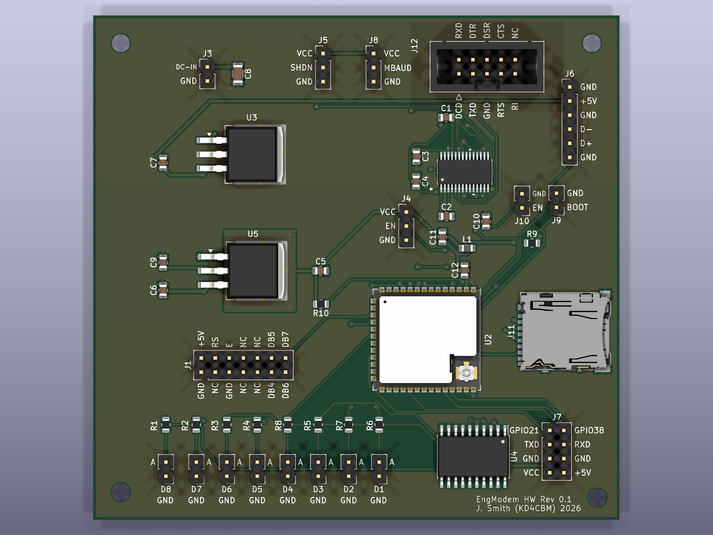
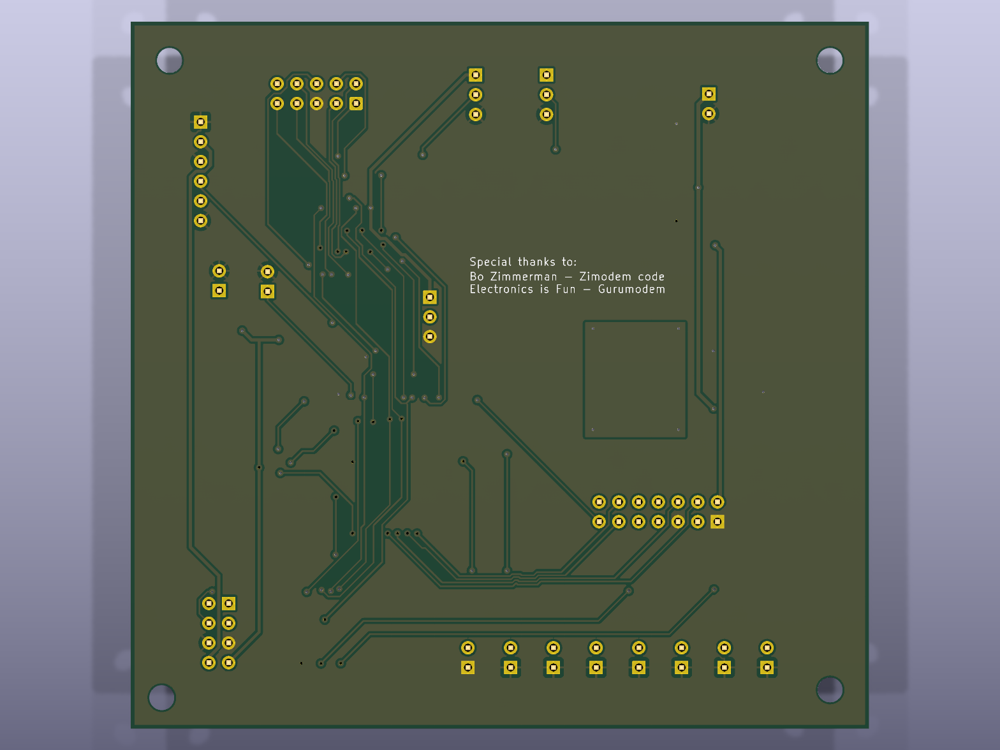

# EngModem Mini

A retro dial-up-modem-styled ESP32-S3 board: RS-232 (true DCE levels via
MAX3237), a 24x2 character VFD status display, a microSD card slot, 8
status LEDs, and USB-C, built around the ESP32-S3-WROOM-1U module. Runs
[Zimodem](https://github.com/BoZimmerman/Zimodem) - Bo Zimmerman's Hayes
AT-command modem emulator/internet gateway - via the
[Zimodem-VFD](https://github.com/kd4cbm/Zimodem-VFD) fork, which adds the
VFD status display this board uses. The firmware qualified on this exact
hardware, further specialised for it, is included in [`firmware/`](firmware/).

## Status: Rev5 built and functionally qualified

One Rev5 board has been built, brought up and bench-qualified with the firmware
in [`firmware/`](firmware/) (revision `firmware-v7-rev1`), September 2026:
programming over USB, boot and debug UART, WiFi, microSD, the VFD, the status
LEDs, RS-232 at every rate from 300 to 921600 baud, RTS/CTS flow control, DTR,
DCD and RI, and byte-exact data integrity through TCP connections. The full
results - and, just as importantly, **what was not tested** (no rail-voltage or
signal-level measurements, single unit, no long soak, no ESD/EMC) - are in
[`docs/QUALIFICATION.md`](docs/QUALIFICATION.md).

Bring-up turned up a few things worth knowing **before you build one**:

- **J12's pin order does not match most ready-made header-to-DE-9 cables** and
  the board will appear dead with one - see [`docs/J12_CABLE_GUIDE.md`](docs/J12_CABLE_GUIDE.md).
- **Three MAX3237 jumpers (J4/J5/J8) must be fitted** - see the jumper table in
  [`docs/BRING_UP.md`](docs/BRING_UP.md#3-set-the-jumpers).
- U3/U5 are hand-soldered and U5 was substituted - see [`docs/ERRATA.md`](docs/ERRATA.md).
- **Most front-panel LEDs read inverted.** MR, TR, SD, RD and CD go through U4, a
  non-inverting buffer, from active-low signals, so on Rev5 as built they are lit when
  they should be dark. The firmware corrects OH, AA and HS; a pin-compatible inverting
  part in place of U4 is the proposed fix for the rest (**not yet built or verified**) -
  see [`docs/ERRATA.md`](docs/ERRATA.md#e11-most-front-panel-leds-read-inverted).
  Also **check the LED order at assembly** (two LEDs were swapped on the tested unit).
- The design-stage "all pins match the firmware" check missed signal direction and LED
  polarity; nine firmware and design issues were found and eight fixed in firmware during
  qualification (the LED inversion of five LEDs needs a hardware change) - see
  [`docs/ERRATA.md`](docs/ERRATA.md#e3-earlier-pin-cross-check-missed-signal-direction) and
  [`docs/QUALIFICATION.md`](docs/QUALIFICATION.md).
- **Use RTS/CTS for long transfers.** With flow control off, a long full-speed two-way stream
  can still lose data (the receive-buffer bug behind most of that is fixed in firmware v6b) -
  see [`docs/ERRATA.md`](docs/ERRATA.md#e12-serial-receive-buffer-was-256-bytes-not-4096-fixed-in-firmware-v6b).

This is a functional qualification of a single unit, not a compliance test.
Expect further revisions.

## Special thanks

This board exists to run [Bo Zimmerman](http://www.zimmers.net)'s
[Zimodem](https://github.com/BoZimmerman/Zimodem) - the Hayes AT-command
modem emulator this whole project is built around. None of this would
have a reason to exist without that project. Thank you, Bo.

## Board overview

- ESP32-S3-WROOM-1U (external U.FL antenna), 16MB flash / 8MB octal PSRAM
- MAX3237-based RS-232 level shifting, wired as **DCE** (straight-through
  DE-9 cable to a PC/terminal) - full modem control set: TXD, RXD, RTS,
  CTS, DTR, DSR, DCD, RI
- Noritake CU24025ECPB-W1J 24x2 character VFD, direct 4-bit parallel
  drive (no I2C bridge)
- microSD card slot (Hirose DM3AT-SF-PEJM5), dedicated SPI pins
- 8 status LEDs, including 3 direct-GPIO-driven (AA/HS/OH)
- USB-C (native USB-Serial-JTAG)
- 2-layer PCB, routed with [Freerouting](https://github.com/freerouting/freerouting) 2.3.0

## Verification

**Design checks** - every revision was checked with KiCad's own tools before
being carried forward:

- **ERC**: 32/32 clean (no unsuppressed errors/warnings)
- **DRC**: 1 finding, a pre-existing benign silkscreen-overlap warning on
  U1; 0 unconnected nets
- **Footprint/schematic sync**: clean
- **Firmware/hardware cross-check (design stage)**: every GPIO the firmware
  references was traced against the schematic netlist pin-by-pin - 18/18
  matched **by GPIO number and net name**. That check did not compare signal
  *direction* and so missed a reversed RTS/CTS assignment, found later on the
  real board and fixed in the firmware; see
  [`docs/ERRATA.md`](docs/ERRATA.md#e3-earlier-pin-cross-check-missed-signal-direction).

**Hardware qualification** - a real Rev5 board, tested on the bench with the
included firmware: [`docs/QUALIFICATION.md`](docs/QUALIFICATION.md).

## Prerequisite libraries

This project uses two public third-party KiCad libraries that aren't
bundled here - install both via KiCad's **Plugin and Content Manager**
before opening the project:

- **Espressif KiCad libraries** (`com_github_espressif_kicad-libraries`) -
  ESP32-S3-WROOM-1U symbol/footprint
- **MAX3237** - U1's symbol/footprint

The project's one genuinely custom dependency, a small `RetroWiFiModem`
library providing the 74HCT245 symbol and its SOIC-20W footprint, is
bundled under [`hardware/kicad/libraries/`](hardware/kicad/libraries/)
and wired up via the project-local `sym-lib-table`/`fp-lib-table`, so it
resolves automatically - no separate install needed for that one.

## RS-232 (J12) - DE-9 female, DCE pinout

DCE pinout in the **AT/Everex header order** (header pin *n* = DE-9 pin *n*) -
wire straight-through to a DTE (PC/terminal). **Many ready-made header-to-DE-9
cables use a different (DTK/Intel) order and will not work** - read
[`docs/J12_CABLE_GUIDE.md`](docs/J12_CABLE_GUIDE.md):

| Pin | 1 | 2 | 3 | 4 | 5 | 6 | 7 | 8 | 9 |
|---|---|---|---|---|---|---|---|---|---|
| Signal | DCD | RXD | TXD | DTR | GND | DSR | RTS | CTS | RI |

Full connector/power-regulation detail (including the U3/U5 substitution
below) is in [`PIN_MAP.md`](PIN_MAP.md); a running changelog is in
[`CHANGES.md`](CHANGES.md).

## Files

- [`firmware/`](firmware/) - the qualified firmware: source, prebuilt
  binaries with checksums, and the hardware QA test scripts (start with its
  [README](firmware/README.md))
- [`docs/`](docs/) - [`BRING_UP.md`](docs/BRING_UP.md) (builder's guide:
  jumpers, first power, flashing, troubleshooting),
  [`QUALIFICATION.md`](docs/QUALIFICATION.md) (test report),
  [`ERRATA.md`](docs/ERRATA.md) (known issues),
  [`J12_CABLE_GUIDE.md`](docs/J12_CABLE_GUIDE.md) (cabling)
- [`hardware/kicad/`](hardware/kicad/) - full KiCad 10 project (schematic
  + PCB), current as of **Rev5**
- [`hardware/kicad/libraries/`](hardware/kicad/libraries/) - bundled
  custom library (see [Prerequisite libraries](#prerequisite-libraries))
- [`enclosure/`](enclosure/) - Hammond 1455U2201BK panel drill/router jigs
  (front: VFD window, LEDs, mounting holes; rear: DB9, USB-C, power
  jack/switch, boot/reset, external antenna) - see its own
  [README](enclosure/README.md) for the preliminary-hardware disclaimer
  and usage instructions
- [`manufacturing/Gerbers_EngModem-Mini_Rev5.zip`](manufacturing/Gerbers_EngModem-Mini_Rev5.zip) -
  Gerber + Excellon drill files, ready to upload to a fab
- [`manufacturing/BOM_PCBA_JLCPCB.csv`](manufacturing/BOM_PCBA_JLCPCB.csv) -
  bill of materials for the SMD parts JLCPCB will assemble, with LCSC part
  numbers verified against LCSC's own listings where a specific
  manufacturer part is called for. Common passives (resistors, most
  capacitors) intentionally list full specs with no pinned LCSC number -
  JLCPCB's basic-parts catalog is a live, dynamic search that isn't
  reliably scriptable, and these are common enough values that matching
  one at checkout takes seconds. **U3 and U5 are intentionally excluded**
  - see below.
- [`manufacturing/BOM_full.csv`](manufacturing/BOM_full.csv) - every part
  on the board, including the through-hole connectors, headers, LED
  positions, and U3/U5, for your own hand-assembly shopping list
- [`manufacturing/CPL_SMD.csv`](manufacturing/CPL_SMD.csv) - placement
  (component position) file for the JLCPCB-assembled SMD parts, in
  JLCPCB's expected column format (`Designator, Mid X, Mid Y, Layer,
  Rotation`), generated directly from the PCB's real component
  coordinates. U3 and U5 excluded, same as the PCBA BOM.

Gerbers + BOM_PCBA_JLCPCB + CPL_SMD together are what JLCPCB's PCBA
(assembly) order flow asks for. **Before ordering, check every SMD part's
orientation and position in JLCPCB's assembly preview tool** - their
preview renders whichever specific LCSC library part it matched to each
BOM row, using that part's own reference point, which doesn't always
agree with KiCad's footprint origin (for angle *or* position). Their
preview UI lets you nudge/rotate a part and save the correction directly,
no file regeneration needed - do that check first, especially for U1
(MAX3237EIPWR) and U2 (the ESP32 module).

### U3 and U5 - excluded from PCBA, hand-solder these

JLCPCB's placement preview surfaced a real footprint mismatch on both
regulators: the originally spec'd parts (HGSEMI LM7805S2/TR for U3, ST
LD1086D2T33TR for U5) don't reliably match this board's 3-lead D2PAK/
TO-263-3 footprint - LCSC's own listings show both as 2-lead packages
(and JLCPCB's 3D model for U3 shows "TO263-5" case marking), while ST's
LD1086 datasheet itself defines two different D²PAK mechanical variants
under one ambiguous order code. Rather than risk a bad PCBA placement,
both are DNP for JLCPCB assembly - `BOM_full.csv` lists verified
replacement parts to hand-solder instead, sourced from Mouser/DigiKey:

- **U3**: onsemi **MC7805CD2TR4G** (D2PAK-3, CASE 936) - confirmed via
  onsemi's own MC7800 datasheet: Pin 1=Input, Pin 2=Ground=Tab, Pin
  3=Output, an exact match to this footprint and the schematic.
- **U5**: TI **LM1086CSX-3.3/NOPB** (DDPAK/TO-263, package KTT; the
  qualified board uses the in-stock **LM1086IS-3.3/NOPB**, same package and
  pinout, industrial temp grade) -
  confirmed via TI's own datasheet: Pin 1=ADJ/GND, Pin 2+Tab=Output, Pin
  3=Input, an exact match to this footprint and the schematic (tab wired
  to Output by design).

## Revision history

| Rev | Notes |
|---|---|
| 0-1 | Original modular layout and placement baseline |
| 2 | SD card socket swapped from a pin header to the real microSD socket (Hirose DM3AT-SF-PEJM5); full reroute |
| 3 | Second SD placement experiment; full reroute; 69 net-derived pin-function silkscreen labels added across every header/LED footprint |
| 4 | Dedicated 0.5mm net class for `/DC-IN`; solid (non-thermal-relief) zone connections on regulator/shield GND tabs; local `/VCC` copper pour + thermal vias around U5; ESP32 power-filter components (L1/C11/C12) relocated for shorter real routed-copper paths to U2 |
| 5 | **Current** - via stitching added under U2's ground-pad cluster (9 vias, exposed copper + matching pads mirrored onto the bottom layer) for bottom-side hand-soldering access; keepout zone added around that cluster, full rip/reroute; U3/U5 excluded from PCBA per the footprint mismatch below |

## License

Hardware design files (schematic, PCB) are released under
[CERN-OHL-S v2](https://cern-ohl.web.cern.ch/) - a strongly-reciprocal
open hardware license: modifications to these design files must be
released under the same license if you distribute hardware built from
them. See [LICENSE](LICENSE).
